Group Assignment 1
================

## Load Data

You can include R code in the document as follows:

``` r
sales <- read_excel("sales-data_clean.xlsx")
sales
```

    ## # A tibble: 225 x 5
    ##     Item  Week Price Sales Remaining_Inventory
    ##    <dbl> <dbl> <dbl> <dbl>               <dbl>
    ##  1     1     1    60    57                1943
    ##  2     1     2    60    98                1845
    ##  3     1     3    60    55                1790
    ##  4     1     4    60    41                1749
    ##  5     1     5    60    60                1689
    ##  6     1     6    60    39                1650
    ##  7     1     7    54   106                1544
    ##  8     1     8    54    55                1489
    ##  9     1     9    54    64                1425
    ## 10     1    10    54    43                1382
    ## # ... with 215 more rows

## Data Exploration

### Add markdown column

``` r
sales['markdown'] <- NA
for (i in seq(1, nrow(sales), by=15)) {
  j = i+13
  for (k in i:j) {
    if (sales[k, 'Price'] != sales[k+1, 'Price']) {
      sales[k+1, 'markdown'] <- (60 - sales[k+1, 'Price'])/60*100
    }
  }
}
sales
```

    ## # A tibble: 225 x 6
    ##     Item  Week Price Sales Remaining_Inventory markdown
    ##    <dbl> <dbl> <dbl> <dbl>               <dbl>    <dbl>
    ##  1     1     1    60    57                1943       NA
    ##  2     1     2    60    98                1845       NA
    ##  3     1     3    60    55                1790       NA
    ##  4     1     4    60    41                1749       NA
    ##  5     1     5    60    60                1689       NA
    ##  6     1     6    60    39                1650       NA
    ##  7     1     7    54   106                1544       10
    ##  8     1     8    54    55                1489       NA
    ##  9     1     9    54    64                1425       NA
    ## 10     1    10    54    43                1382       NA
    ## # ... with 215 more rows

### Function: Plot the markdown strategy

``` r
plot_strategy <- function(data, col, miny, maxy, min_limit, max_limit) {
  vlines <- c()
  for (row in 1:nrow(data)){
    if (!is.na(data$markdown[row])){
      vlines <- append(vlines, data$Week[row])
    }
  }
  p <- ggplot(data, aes_string("Week", col)) + geom_point() +
    geom_point(aes(x=miny, y=maxy)) + xlim(0, 15) + ylim(min_limit, max_limit) +
    geom_vline(xintercept = vlines, color="red", linetype = "dotted") + 
    geom_text(aes(x=vlines, label="Markdown", y=max_limit), colour="red") +
    ggtitle(paste("Item", data$Item[1]))
  p
}
```

### Plot strategy for each item

``` r
for (i in seq(1, nrow(sales), by=15)) {
  j = i + 14
  print(plot_strategy(sales[i:j,], "Remaining_Inventory", 0, 2000, 0, 2000))
}
```

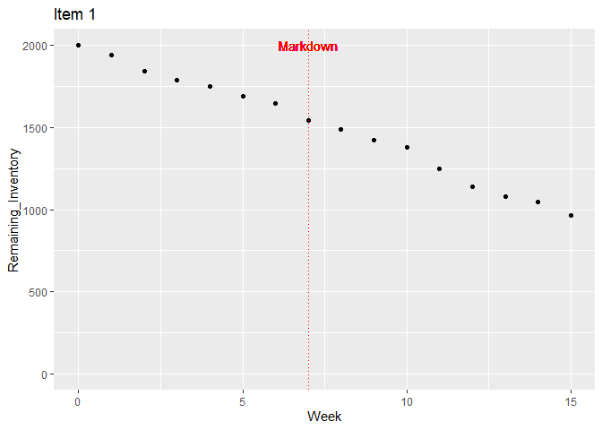<!-- -->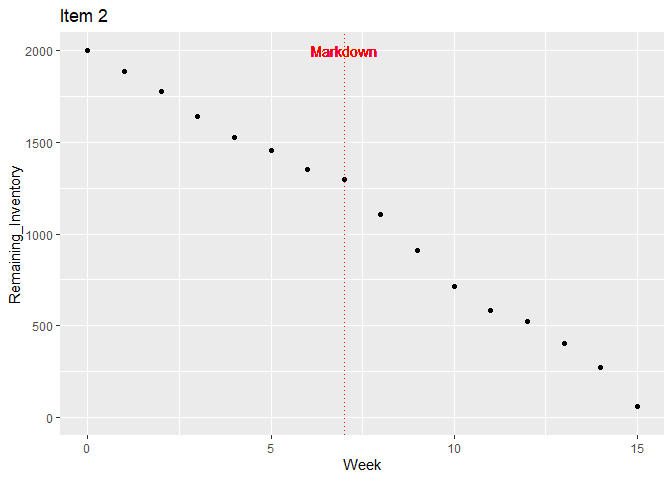<!-- --><!-- --><!-- -->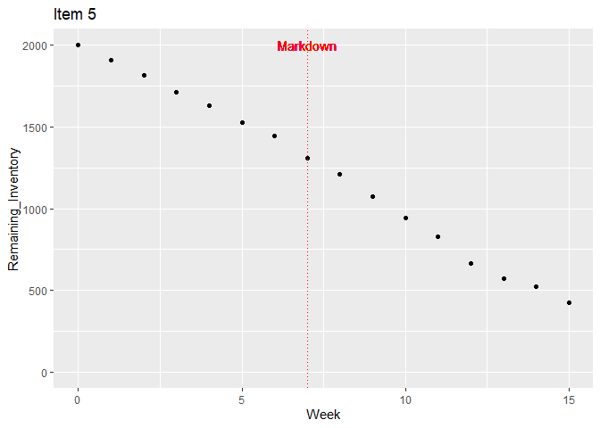<!-- -->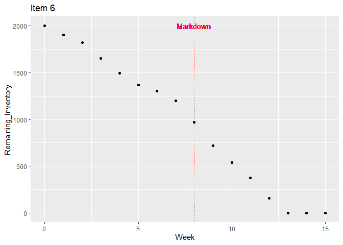<!-- -->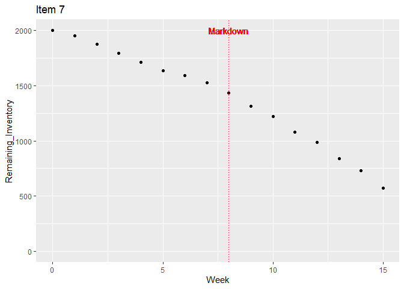<!-- --><!-- -->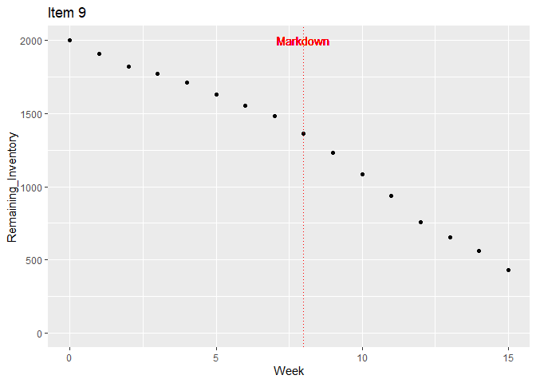<!-- -->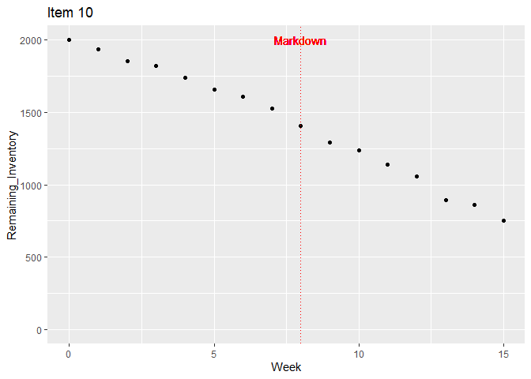<!-- -->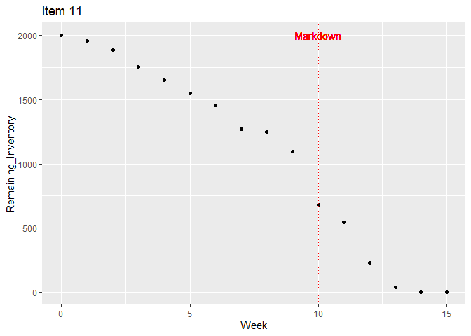<!-- -->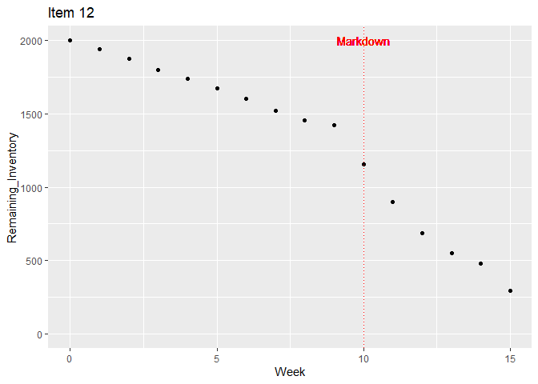<!-- -->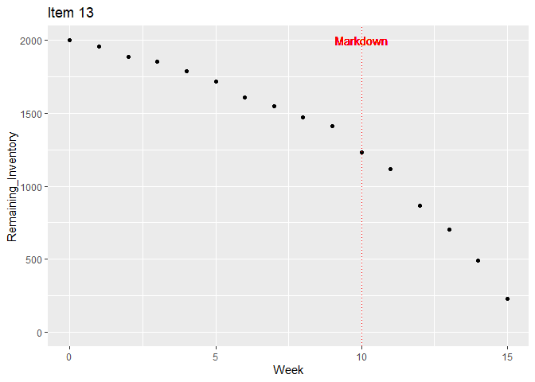<!-- -->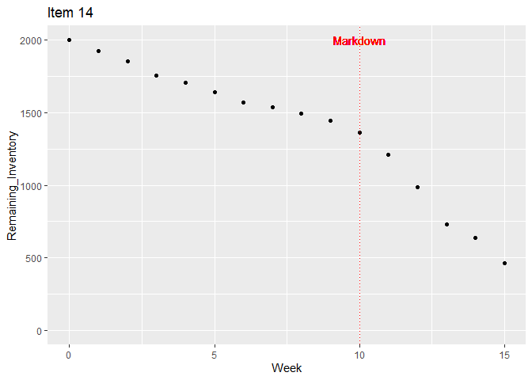<!-- --><!-- -->

# Add sales difference column

``` r
sales['sales_diff'] <- NA
for (i in seq(1, nrow(sales), by=15)) {
  j = i+13
  for (k in i:j) {
    sales[k+1, 'sales_diff'] <- round((sales[k+1, 'Sales'] - sales[k, 'Sales']) / sales[k, 'Sales'], 2)
  }
}
sales
```

    ## # A tibble: 225 x 7
    ##     Item  Week Price Sales Remaining_Inventory markdown sales_diff
    ##    <dbl> <dbl> <dbl> <dbl>               <dbl>    <dbl>      <dbl>
    ##  1     1     1    60    57                1943       NA      NA   
    ##  2     1     2    60    98                1845       NA       0.72
    ##  3     1     3    60    55                1790       NA      -0.44
    ##  4     1     4    60    41                1749       NA      -0.25
    ##  5     1     5    60    60                1689       NA       0.46
    ##  6     1     6    60    39                1650       NA      -0.35
    ##  7     1     7    54   106                1544       10       1.72
    ##  8     1     8    54    55                1489       NA      -0.48
    ##  9     1     9    54    64                1425       NA       0.16
    ## 10     1    10    54    43                1382       NA      -0.33
    ## # ... with 215 more rows

### Plot sales difference for each item

``` r
for (i in seq(1, nrow(sales), by=15)) {
  j = i + 14
  print(plot_strategy(sales[i:j,], "sales_diff", 0, 0, -2.5, 2.5))
}
```

    ## Warning: Removed 1 rows containing missing values (geom_point).

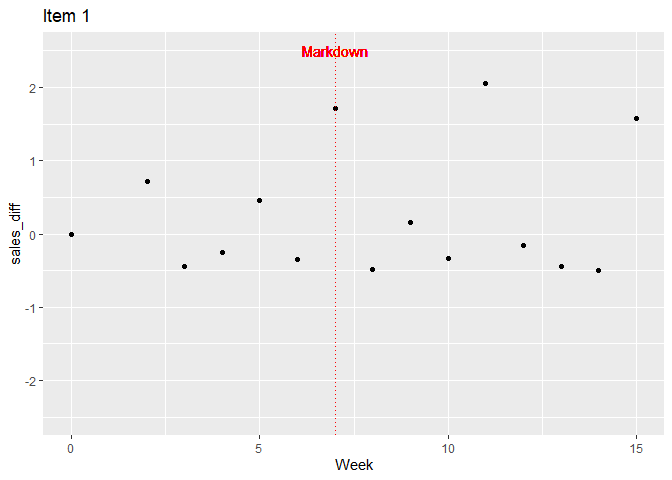<!-- -->

    ## Warning: Removed 1 rows containing missing values (geom_point).

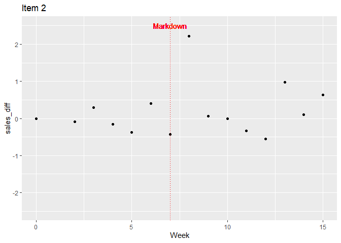<!-- -->

    ## Warning: Removed 1 rows containing missing values (geom_point).

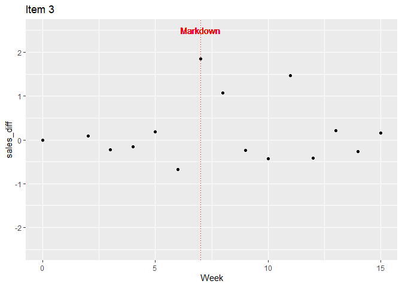<!-- -->

    ## Warning: Removed 1 rows containing missing values (geom_point).

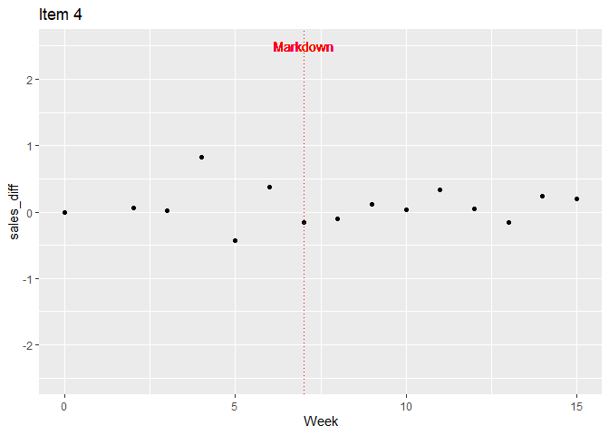<!-- -->

    ## Warning: Removed 1 rows containing missing values (geom_point).

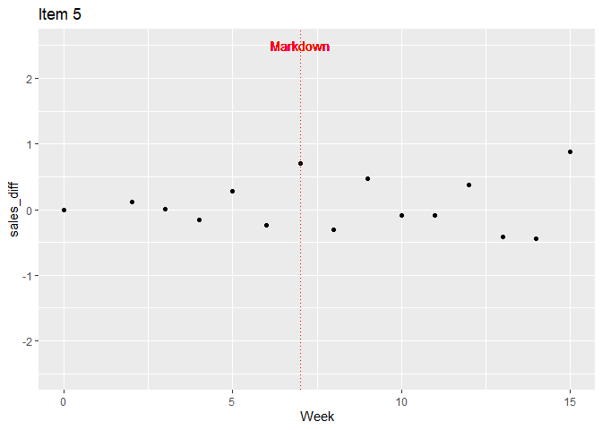<!-- -->

    ## Warning: Removed 2 rows containing missing values (geom_point).

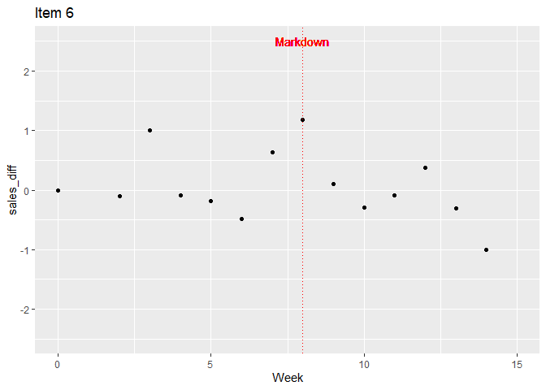<!-- -->

    ## Warning: Removed 1 rows containing missing values (geom_point).

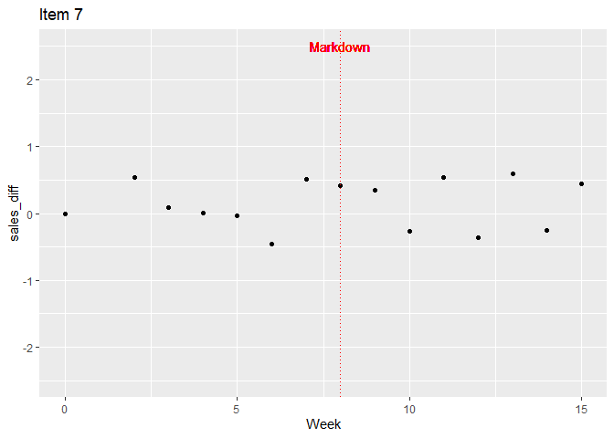<!-- -->

    ## Warning: Removed 1 rows containing missing values (geom_point).

<!-- -->

    ## Warning: Removed 1 rows containing missing values (geom_point).

<!-- -->

    ## Warning: Removed 1 rows containing missing values (geom_point).

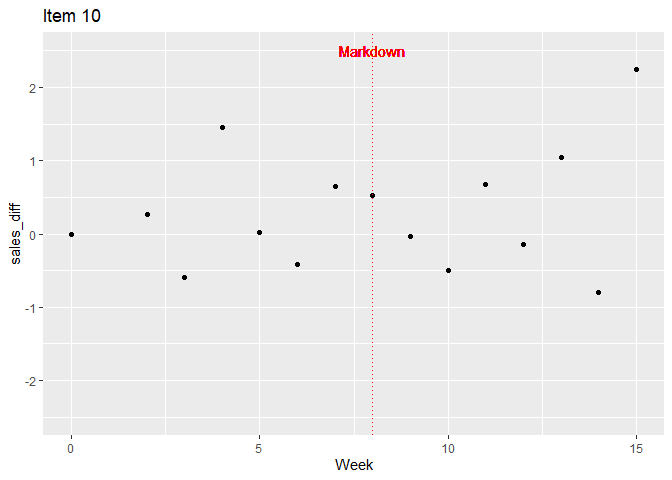<!-- -->

    ## Warning: Removed 2 rows containing missing values (geom_point).

<!-- -->

    ## Warning: Removed 2 rows containing missing values (geom_point).

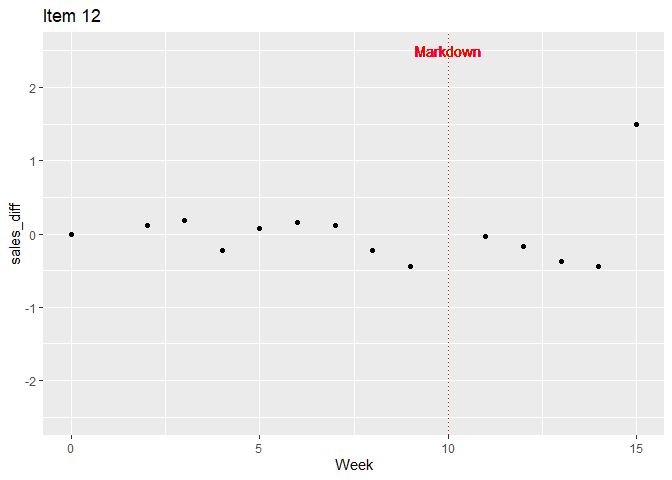<!-- -->

    ## Warning: Removed 1 rows containing missing values (geom_point).

<!-- -->

    ## Warning: Removed 1 rows containing missing values (geom_point).

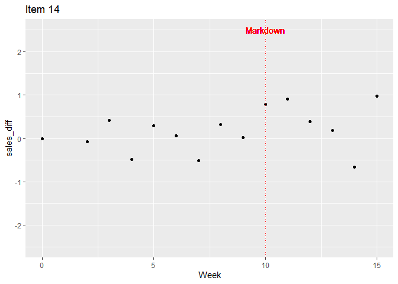<!-- -->

    ## Warning: Removed 2 rows containing missing values (geom_point).

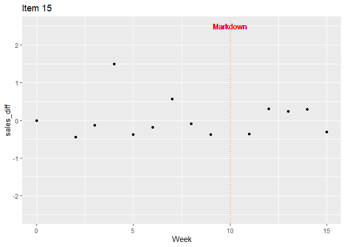<!-- -->

### Function: Calculate the revenue

``` r
calculate_revenue <- function(data) {
  revenue = 0
  for(row in 1:nrow(data)){
    revenue = revenue + data$Price[row] * data$Sales[row]
  }
  return(revenue)
}
```

### Function: Get strategy

``` r
strategize <- function(data){
  for (row in 1:nrow(data)){
    if (!is.na(data$markdown[row])) {
      col <- c(data$Item[row], data$Week[row], data$markdown[row], 
               calculate_revenue(data), data$Remaining_Inventory[nrow(data)])
      strategy[nrow(strategy) + 1,] <- col
    }
  }
  return(strategy)
}
```

### Get strategy for each item

``` r
# add first row to remove later
item <- c(0)
week <- c(0)
markdown <- c(0)
revenue <- c(0)
remaining <- c(0)
strategy <- data.frame(item, week, markdown, revenue, remaining)

for (i in seq(1, nrow(sales), by=15)) {
  j = i + 14
  strategy <- strategize(sales[i:j,])
}

# remove first row
strategy = strategy[-1,]
rownames(strategy) <- 1:nrow(strategy)
strategy
```

    ##    item week markdown revenue remaining
    ## 1     1    7       10   57936       966
    ## 2     2    7       10  108744        58
    ## 3     3    7       10   61374       903
    ## 4     4    7       10   59874       932
    ## 5     5    7       10   88542       422
    ## 6     6    8       20  105588         0
    ## 7     7    8       20   74256       571
    ## 8     8    8       20   59412       855
    ## 9     9    8       20   81600       429
    ## 10   10    8       20   65556       752
    ## 11   11   10       40   93696         0
    ## 12   12   10       40   75336       292
    ## 13   13   10       40   77880       230
    ## 14   14   10       40   68604       463
    ## 15   15   10       40   71460       389

### Re-order strategy by decreasing remaining inventory

``` r
strategy_ordered <- strategy[order(strategy$remaining, decreasing = FALSE),]
strategy_ordered
```

    ##    item week markdown revenue remaining
    ## 6     6    8       20  105588         0
    ## 11   11   10       40   93696         0
    ## 2     2    7       10  108744        58
    ## 13   13   10       40   77880       230
    ## 12   12   10       40   75336       292
    ## 15   15   10       40   71460       389
    ## 5     5    7       10   88542       422
    ## 9     9    8       20   81600       429
    ## 14   14   10       40   68604       463
    ## 7     7    8       20   74256       571
    ## 10   10    8       20   65556       752
    ## 8     8    8       20   59412       855
    ## 3     3    7       10   61374       903
    ## 4     4    7       10   59874       932
    ## 1     1    7       10   57936       966
